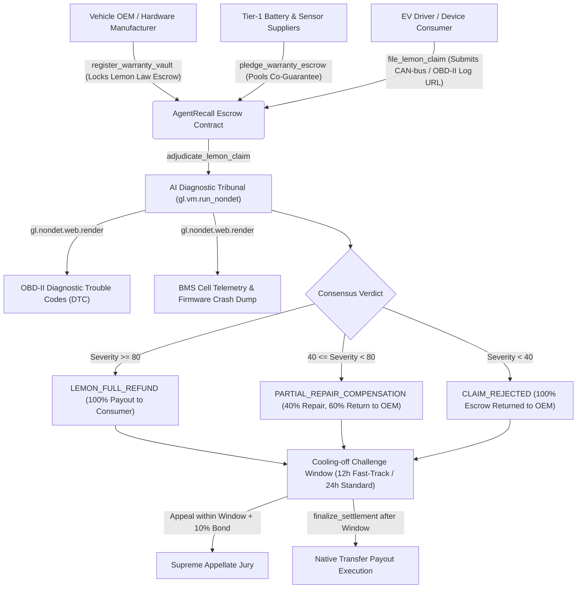

# ⚡ AgentRecall: Protocol Architecture & Consensus Mechanics

## Overview
AgentRecall is an autonomous IoT & EV firmware Lemon Law escrow and diagnostic court deployed on GenLayer. It bridges automotive consumer protection legislation with subjective AI validator consensus.

## Consensus Security & Injection Defense
1. **Security Canary Token**: `CANARY_AGENT_RECALL_LEMON_V1` is strictly enforced in the system prompt and validated in `validator_fn`.
2. **XML Isolation Boundaries**: All external diagnostic telemetry text is wrapped in `<telemetry>` tags and treated as untrusted inputs.
3. **Dual Cryptographic Digest**: The contract calculates `SHA-256(raw_diagnostic)` and requires leader and validator consensus to match the snapshot digest.
4. **Milestone v3 Fast-Track Engine**: OEMs with Gold ($\ge 50$ pts) or Platinum ($\ge 100$ pts) trust status automatically unlock an expedited 12-block dispute window.
